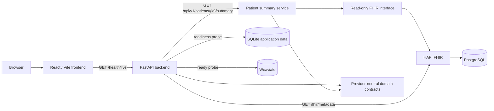
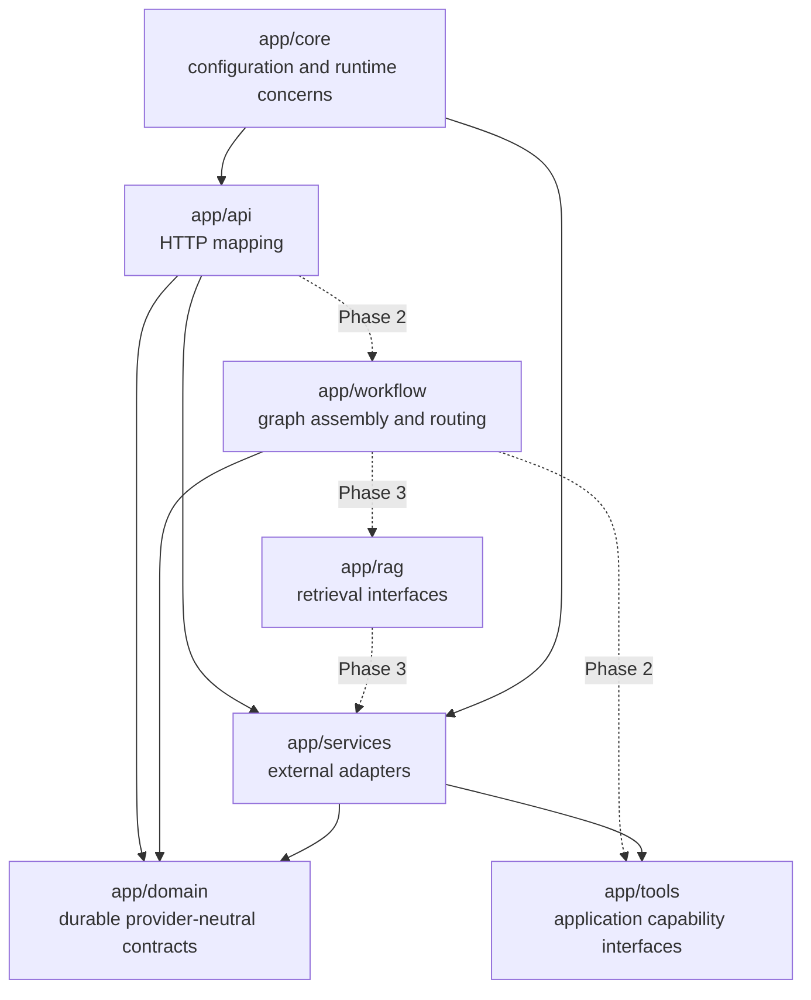
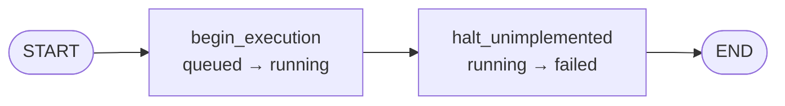
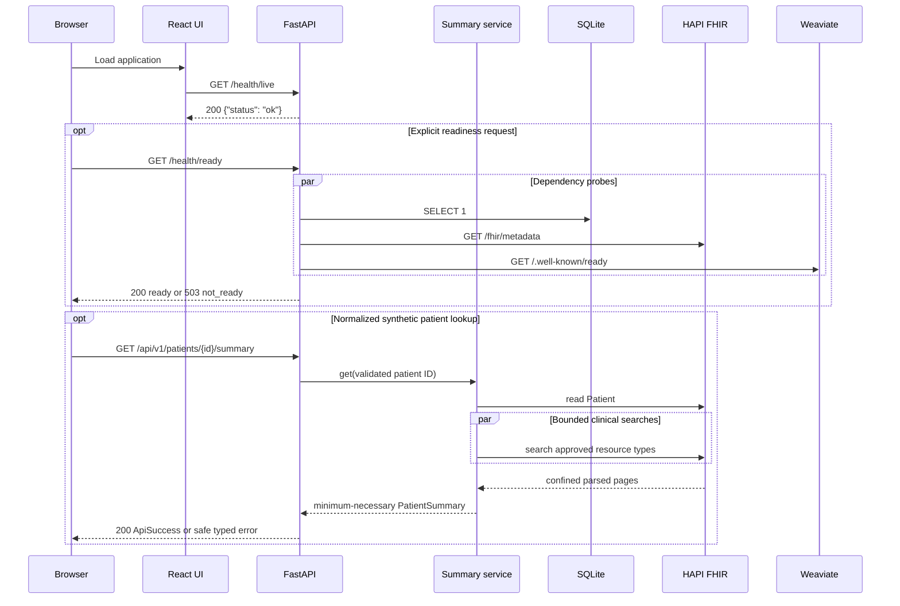
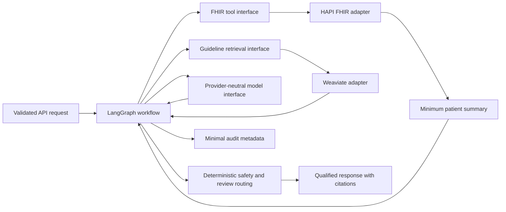

# Current Architecture

## Current System

Phase 1 adds reproducible synthetic FHIR seeding, a bounded read-only HAPI
adapter, minimum-necessary normalization, and a normalized patient-summary API
to the Phase 0 application and infrastructure foundation. Guideline ingestion,
model calls, and LangGraph execution remain unimplemented.

All host-published service ports bind to `127.0.0.1`. HAPI FHIR and Weaviate
are local development dependencies. PostgreSQL is HAPI's internal persistence
store; application code and pgAdmin users must not insert directly into HAPI's
tables.

## Backend Component Boundaries

Solid arrows represent current dependencies. Dotted arrows are planned
extension paths and do not imply implemented behavior. The patient API creates
a request-scoped HAPI adapter, injects it into the summary service through the
read-only FHIR interface, and closes the transport after the request.

## Current Workflow Skeleton

Phase 2.1 introduces only lifecycle mechanics and contains no clinical
behavior:

The graph wraps the durable `WorkflowState` with an append-only transition
list. An immutable run-scoped context supplies the application-owned clock.
Until later sub-phases add reviewed nodes, every execution ends with the stable
`workflow_not_implemented` failure code.

Boundary rules:

- `api` translates HTTP input and output; workflow rules do not belong there.
- `workflow` owns graph nodes, routing, and graph assembly.
- `tools` defines constrained application capabilities used by graph nodes.
- `rag` owns guideline ingestion and retrieval interfaces.
- `services` contains HAPI FHIR, Weaviate, model, persistence, and audit
  adapters.
- `domain` owns durable types and must not import vendor SDK objects.
- `core` owns validated settings and shared runtime concerns.
- The frontend calls only the application API. It never connects directly to
  HAPI FHIR, PostgreSQL, Weaviate, SQLite, or a model provider.

## Local Data Flow

Health reporting and normalized synthetic patient lookup are implemented:

Readiness responses expose stable dependency states, not raw exceptions,
credentials, connection strings, or patient resources. Patient lookup errors
similarly expose stable application codes rather than HAPI payloads or
transport details.

## Planned Clinical Request Flow

Later phases will extend the existing boundaries in this order:

Raw FHIR resources, Weaviate results, and model-provider responses are
normalized inside their adapters. Only minimum-necessary, application-owned
types cross into workflow state.

## Storage Ownership

| Store | Owner | Current use | Reset behavior |
|---|---|---|---|
| SQLite | Application backend | Readiness probe and future application state | `make app-data-reset CONFIRM=1` |
| PostgreSQL | HAPI FHIR | HAPI schema and synthetic FHIR cohort | Removed with `make infra-reset CONFIRM=1` |
| Weaviate | Retrieval adapter | Readiness only; no corpus is loaded | Removed with `make infra-reset CONFIRM=1` |

Docker volumes survive `make infra-down`. Reset commands are intentionally
guarded because they delete local development data.

## Safety and Trust Boundaries

- Only synthetic patient data is permitted.
- This project is an educational workflow demonstration, not a medical device.
- Generated output must not be represented as medical advice.
- Patient context, user requests, and retrieved guideline text are untrusted
  inputs.
- Full FHIR resources, prompts containing patient context, secrets, and raw
  document bodies must not be logged.
- Deterministic safety rules and human-review decisions remain explicit domain
  results rather than hidden prompt behavior.
- Local anonymous Weaviate access and documented development credentials are
  not production security controls.

See [Development Safety and Data Policy](SAFETY_AND_DATA_POLICY.md) for the
complete requirements.
