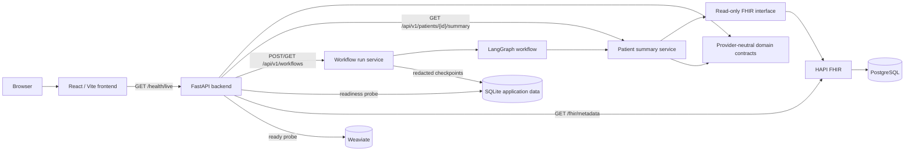
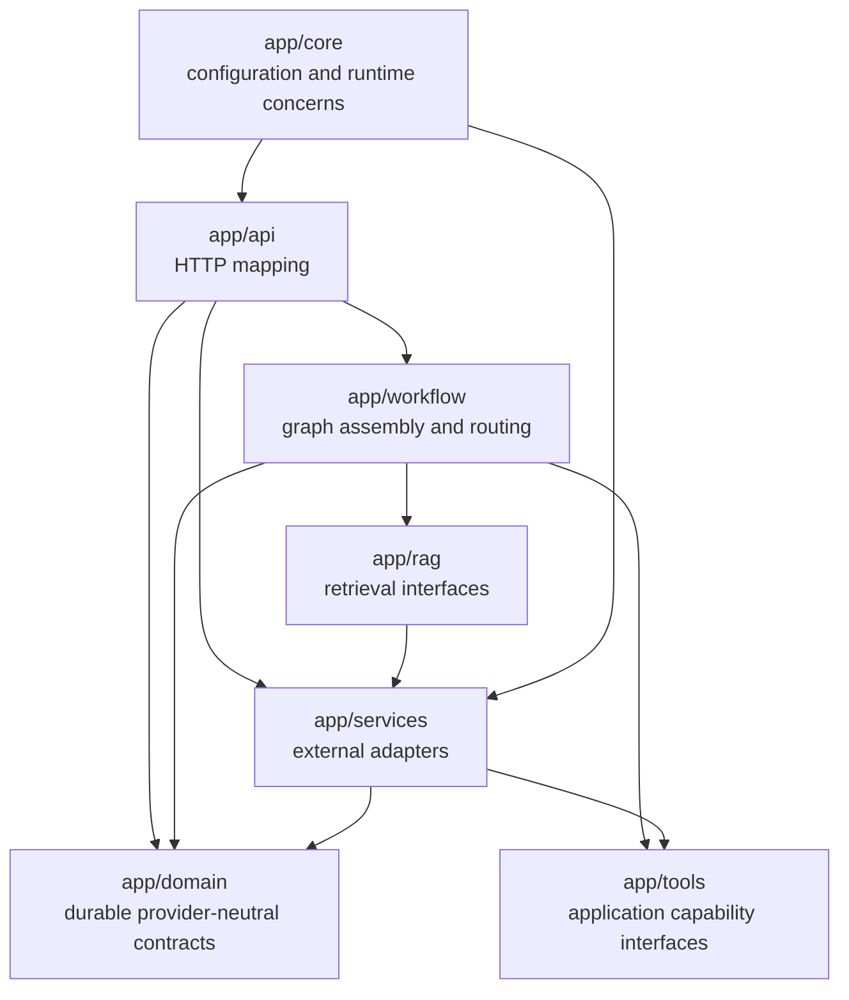
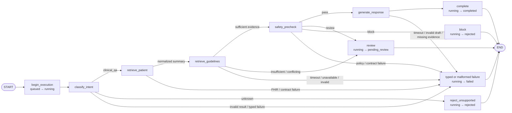
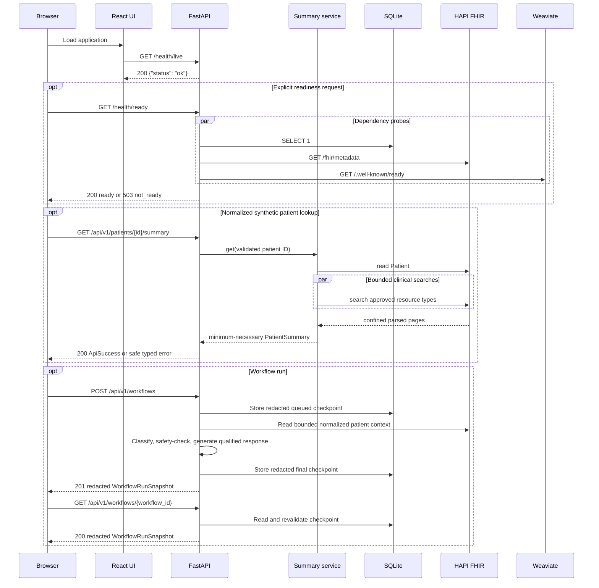
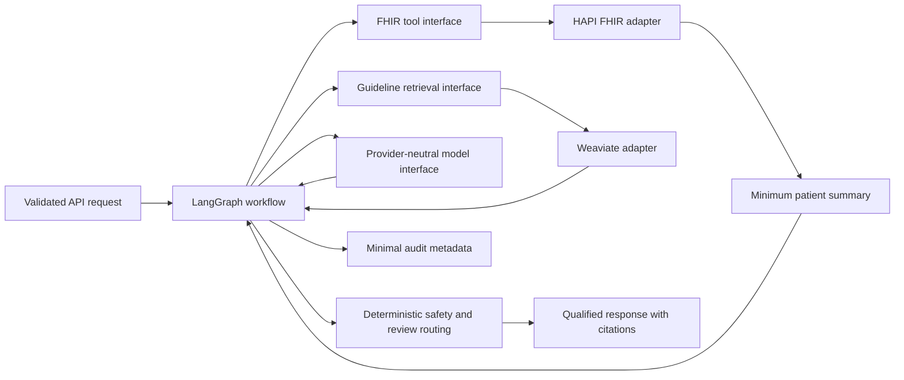

# Current Architecture

## Current System

Completed Phase 2 extends the application foundation and Phase 1 synthetic FHIR
path with a typed LangGraph workflow. Phase 3.1 adds provider-neutral guideline
source, permission, chunk, retrieval, evidence, citation-lineage, and safe
failure contracts. Phase 3.2 adds two checksum-locked, ignored local WHO PDFs
and guarded acquisition/verification tooling. Phase 3.3 adds a strict bounded
pypdf adapter and 135 deterministic, page-confined local chunks whose text
remains ignored. Nothing is embedded, indexed, or retrieved yet. The graph validates input, classifies intent,
retrieves only normalized patient context, and applies a deterministic safety
pre-check before producing a qualified deterministic response and minimal
audit events. Synchronous run creation/status APIs persist redacted queued and
final checkpoints in SQLite. Guideline ingestion and real model-provider calls
remain unimplemented.

The Phase 2 live gate verifies this complete path against the checksum-locked
`sparse-control-01` fixture and confirms the redacted final snapshot can be
read back unchanged from SQLite.

All host-published service ports bind to `127.0.0.1`. HAPI FHIR and Weaviate
are local development dependencies. PostgreSQL is HAPI's internal persistence
store; application code and pgAdmin users must not insert directly into HAPI's
tables.

## Backend Component Boundaries

Solid arrows represent current runtime dependencies. Dotted arrows are planned
extension paths and do not imply connected runtime behavior. The `rag` package
exposes the application-owned retrieval protocol and typed safe failures. The
workflow API creates a request-scoped HAPI adapter and a lazy local guideline
retriever, injects both through application interfaces, and closes any opened
transports after the request. The workflow graph receives its clock,
classifier, normalized patient reader, guideline retriever, safety policy,
response generator, audit-event ID source, and bounded execution policy through
immutable run-scoped context. The workflow-run service owns identity, redacted
checkpoint persistence, inspection, and restart recovery.

## Current Workflow Graph

Phase 2.5 wraps the Phase 2.4 graph with bounded external capability execution,
redacted checkpoint persistence, and safe interrupted-run recovery:

The graph wraps the in-memory `WorkflowState` with an append-only transition
list. An immutable run-scoped context supplies the application-owned clock.
It also supplies application-owned classifier, normalized patient-summary,
guideline-retrieval, safety-policy, response-generator, and audit-ID
capabilities. The clinical path requires retrieval and validates and projects
evidence before safety evaluation. Insufficient or conflicting evidence pauses
for review; typed and malformed failures terminate safely. Sufficient evidence
and a safety pass allow generation with the exact application-owned citations.
Review and block outcomes terminate without approval/resume behavior, which
remains deferred to Phase 4.

Classifier, patient-summary, guideline-retrieval, safety, and response calls
have a configurable timeout and bounded retry count. Retryable operations are
side-effect-free. Unexpected capability errors become stable failed results
rather than escaping into API responses.

Boundary rules:

- `api` translates HTTP input and output; workflow rules do not belong there.
- `workflow` owns graph nodes, routing, and graph assembly.
- `tools` defines constrained application capabilities used by graph nodes.
- `rag` owns guideline ingestion and retrieval interfaces.
- `services` contains HAPI FHIR, Weaviate, model, persistence, and audit
  adapters.
- `domain` owns durable types and must not import vendor SDK objects.
- `core` owns validated settings and shared runtime concerns.
- The frontend calls only the application API. It never connects directly to
  HAPI FHIR, PostgreSQL, Weaviate, SQLite, or a model provider.

## Local Data Flow

Health reporting, normalized synthetic patient lookup, and synchronous workflow
runs are implemented:

Readiness responses expose stable dependency states, not raw exceptions,
credentials, connection strings, or patient resources. Patient lookup errors
similarly expose stable application codes rather than HAPI payloads or
transport details.

## Planned Clinical Request Flow

Later phases will extend the existing boundaries in this order:

Raw FHIR resources, Weaviate results, and model-provider responses are
normalized inside their adapters. Only minimum-necessary, application-owned
types cross into workflow state.

## Storage Ownership

| Store | Owner | Current use | Reset behavior |
|---|---|---|---|
| SQLite | Application backend | Readiness plus redacted workflow queued/final checkpoints | `make app-data-reset CONFIRM=1` |
| PostgreSQL | HAPI FHIR | HAPI schema and synthetic FHIR cohort | Removed with `make infra-reset CONFIRM=1` |
| Weaviate | Guideline vector-store adapter | `ClinicalGuidelineChunkV1` holds 135 verified chunks from two reviewed sources with self-provided vectors | `make guidelines-index-reset CONFIRM=1` deletes only the app collection; infrastructure reset deletes the volume |
| Local guideline directory | Developer acquisition tooling | Two ignored PDF artifacts verified against committed provenance/checksums | Manually remove ignored files; `make guidelines-fetch` restores them |

Docker volumes survive `make infra-down`. Reset commands are intentionally
guarded because they delete local development data.

The guideline collection schema is application-owned and versioned in its
name. Stable UUIDv5 object identity includes schema, parser, embedding model,
chunk ID, and chunk checksum. Filterable metadata includes source and chunk
identity, publisher, lifecycle, publication date, topic, page, sequence, and
checksums. Patient identifiers, patient summaries, prompts, and workflow data
are not accepted by the index contract. Weaviate SDK objects remain inside the
adapter.

## Safety and Trust Boundaries

- Only synthetic patient data is permitted.
- This project is an educational workflow demonstration, not a medical device.
- Generated output must not be represented as medical advice.
- Patient context, user requests, and retrieved guideline text are untrusted
  inputs.
- Full FHIR resources, prompts containing patient context, secrets, and raw
  document bodies must not be logged.
- Deterministic safety rules and human-review decisions remain explicit domain
  results rather than hidden prompt behavior.
- Local anonymous Weaviate access and documented development credentials are
  not production security controls.

See [Development Safety and Data Policy](SAFETY_AND_DATA_POLICY.md) for the
complete requirements.
